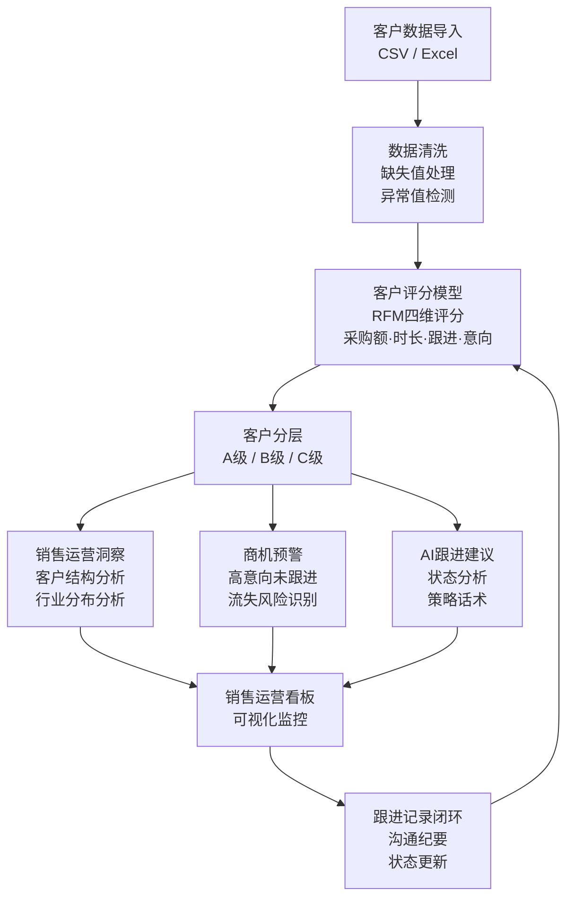

# AI销售运营助手

> 面向B2B销售团队的销售运营决策平台 — 客户分层 · AI跟进 · 商机预警 · 运营洞察

[//]: # "Streamlit App 部署链接"

---

## 项目简介

AI销售运营助手是一个轻量级的销售运营决策工具，帮助销售团队自动完成客户分层、跟进优先级排序、商机预警和策略生成。

项目模拟了真实销售运营工作流：从客户数据导入 → 数据清洗 → 评分分层 → 运营洞察 → 跟进建议 → 看板监控 → 跟进记录闭环。不依赖任何外部CRM系统，数据即传即用。

**适用场景：** 销售运营日报周报生成、客户健康度评估、商机挖掘、流失预警。

---

## 核心功能

| 功能 | 说明 |
|------|------|
| **客户分层评分** | 基于RFM模型的四维评分体系（采购额/合作时长/跟进频率/意向等级），自动输出A/B/C三级分类 |
| **权重动态配置** | 用户可根据业务重心实时调整各维度权重，评分与分层即时更新，适应不同销售策略 |
| **AI跟进建议** | 集成OpenAI API，自动生成客户状态分析、跟进时机、策略话术和风险提示；无API时由规则引擎兜底 |
| **销售运营看板** | Plotly可视化客户结构、行业分布、采购趋势、跟进情况，支持交互式数据探索 |
| **脏数据检测** | 自动识别缺失值、异常客户模式，处理真实业务中常见的脏数据场景 |
| **商机预警** | 规则引擎自动发现高意向未跟进、高价值低意向、跟进频率下降等商机遗漏与流失风险 |
| **跟进记录闭环** | 支持在系统内记录每次客户沟通内容，形成"分析→建议→跟进→记录"的完整闭环 |

---

## 系统架构



---

## 使用流程

```
1. 上传客户数据 → 支持 CSV / Excel，内置 22 条模拟数据可直接体验

2. 调整评分权重 → 根据业务策略实时调节采购额/时长/跟进/意向权重

3. 查看客户分层 → A/B/C 三级展示，含评分明细和数据异常提示

4. 浏览运营洞察 → 系统自动输出结构分析、商机预警、流失风险、行动建议

5. 获取跟进建议 → 选择客户，AI 生成跟进策略与话术；无 API 时规则引擎兜底

6. 记录跟进内容 → 每次沟通后在系统内记录纪要，追踪客户状态变化

7. 监控销售看板 → 客户结构、行业分布、采购趋势、跟进情况全局可视化
```

---

## 技术栈

| 层 | 技术 | 用途 |
|----|------|------|
| 框架 | Streamlit | 应用容器，前后端一体 |
| 语言 | Python 3.10+ | 全部逻辑 |
| 数据处理 | Pandas | CSV/Excel 读取、清洗、分组聚合 |
| 可视化 | Plotly | 交互式图表（柱状图、饼图、散点图） |
| AI | OpenAI GPT-4o-mini | 跟进建议生成（可选，可降级） |
| 规则引擎 | Python 逻辑 | 评分模型、商机预警、运营洞察 |
| 部署 | Streamlit Cloud | 一键部署，自动同步 GitHub |

---

## 项目亮点

- **真实业务场景驱动**：选题来自京东销售运营JD的AI工具要求，功能设计贴合销售运营日常
- **双轨AI设计**：OpenAI API 与规则引擎并存，有 API 走 AI 生成、无 API 降级规则，体现工程冗余思维
- **RFM 模型改造**：将经典 RFM 客户分析模型适配到 B2B 销售场景，权重可调，适应不同业务策略
- **数据异常感知**：自动检测缺失值、高意向未跟进、高价值低意向、老客户跟进下降等业务异常
- **分析到行动闭环**：不止于展示数据，能从数据中发现问题并输出具体行动建议
- **面试导向设计**：每个功能都对应一个面试回答场景，支持 30 秒 / 3 分钟两种介绍节奏

---

## 快速开始

```bash
# 安装依赖
pip install -r requirements.txt

# 启动应用
streamlit run app.py

# 浏览器打开 http://localhost:8501
```

内置 22 条模拟企业客户数据，覆盖 10+ 行业，含缺失值和异常模式，无需额外准备数据。

---

## 目录结构

```
ai-sales-ops-assistant/
├── app.py                      # 应用入口 / 导航主页
├── pages/
│   ├── 01_客户分析.py           # 客户分层 + 权重配置 + 运营洞察
│   ├── 02_跟进建议.py           # AI跟进建议 + 跟进记录
│   └── 03_销售看板.py           # 销售运营看板
├── utils/
│   ├── data_processor.py       # 数据处理 / 评分模型 / 洞察引擎
│   └── ai_helper.py            # AI建议 / 规则引擎降级
├── data/
│   └── demo_clients.csv        # 22条演示客户数据
├── .streamlit/
│   └── config.toml             # 应用主题配置
├── requirements.txt
└── README.md
```

---

## 未来规划

- **跟进记录持久化**：接入轻量数据库，跨会话保存跟进历史
- **销售维度扩展**：增加 "销售→客户" 关联，支持团队协作视图
- **预警阈值配置**：用户自定义商机预警和流失风险判定规则
- **报告导出**：一键导出运营周报 PDF / Excel
