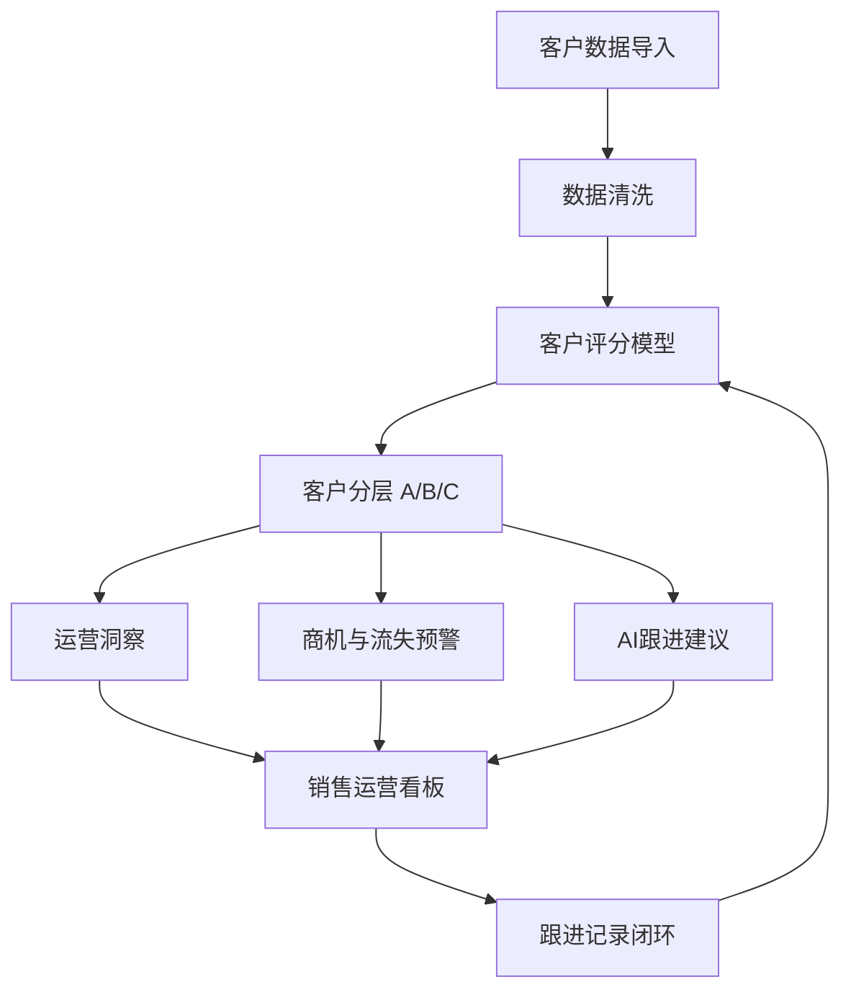

# AI销售运营助手

> 客户分层 · AI跟进建议 · 商机预警 · 销售运营看板

**一个从销售运营场景出发的AI辅助决策工具：上传客户数据 → 自动分层评分 → AI生成跟进建议 → 看板监控。覆盖从客户洞察到销售行动的完整闭环。**

[](https://ai-sales-ops-assistant-nhihgfr9twrytdrmdatbbr.streamlit.app)
[](https://github.com/Jofish07/ai-sales-ops-assistant)

---

## 项目背景

AI正在从开发团队走向业务团队。越来越多的业务岗位开始使用AI工具辅助日常决策——从数据分析到内容生成到客户洞察。

但在销售运营领域，一个普遍的问题是：

**客户知识分散在个人经验中。**

一个销售主管离开团队，他积累的客户判断经验、跟进节奏、沟通偏好——这些很难快速复制给新人。团队扩张时，新销售需要很长时间才能建立起自己的客户判断体系。

这个项目的出发点很简单：

尝试用数据分析和AI能力，把部分销售运营经验沉淀为可复用的流程——让销售团队可以更快识别高价值客户、更早发现流失风险、更规范地执行跟进。不是用AI替代销售，而是用AI辅助销售运营决策。

---

## 核心功能

| 功能 | 说明 |
|------|------|
| **客户分层评分** | 基于四维评分体系（采购贡献/合作周期/跟进活跃度/意向等级），自动输出ABC分类，辅助资源优先级分配 |
| **权重动态配置** | 用户可根据业务重心实时调整各维度权重，适应不同销售策略 |
| **AI跟进建议** | 集成OpenAI API，自动生成客户状态分析、跟进时机与策略话术；无API时由规则引擎降级兜底 |
| **销售运营看板** | Plotly可视化客户结构、行业分布、采购趋势与跟进情况，支持交互式探索 |
| **脏数据检测** | 自动识别缺失值、异常客户模式，处理真实业务中常见的脏数据场景 |
| **商机与流失预警** | 规则引擎自动发现高意向未跟进、高价值低意向、跟进频率下降等业务异常 |
| **跟进记录闭环** | 支持记录每次客户沟通内容，形成"分析→建议→跟进→记录"的完整循环 |

---

## 系统架构



---

## 项目亮点

### 销售知识沉淀视角
项目不是"用AI替代销售"，而是帮助团队把分散在个人经验中的客户判断逻辑，沉淀为可复用的分析流程。新人可以借助工具快速建立客户认知，资深销售可以腾出精力做更有价值的客户沟通。

### AI辅助而非替代
双轨设计：OpenAI API负责生成客户分析和话术建议（需要时）；规则引擎负责评分、预警和兜底（无API时全功能运行）。AI提供参考判断，最终决策权在销售手中。

### 分析到行动闭环
不止于展示数据——能从客户数据中发现问题（哪些客户快流失了、哪些客户出现采购信号），并输出具体的跟进建议和话术。从洞察到行动一步到位。

### B2B销售场景适配
评分模型在经典RFM框架基础上，针对B2B销售场景做了调整——加入"跟进活跃度"等维度，适应关系型销售的业务特点。权重可配置，不同行业和策略都能适用。

---

## 技术栈

| 层 | 技术 | 用途 |
|----|------|------|
| 框架 | Streamlit | 应用容器，前后端一体 |
| 语言 | Python | 全部逻辑实现 |
| 数据处理 | Pandas | 数据读取、清洗、分组聚合 |
| 可视化 | Plotly | 交互式图表 |
| AI | OpenAI API | 跟进建议生成（可选，规则引擎兜底） |
| 规则引擎 | Python逻辑 | 评分模型、商机预警、运营洞察 |
| 部署 | Streamlit Cloud | 一键部署，自动同步GitHub |

---

## 使用流程

```
1. 上传客户数据 → 支持CSV/Excel，内置22条模拟数据可直接体验
2. 调整评分权重 → 根据业务策略调节各维度权重
3. 查看客户分层 → ABC三级展示，含评分明细和数据异常提示
4. 浏览运营洞察 → 系统自动输出结构分析、商机预警、流失风险
5. 获取跟进建议 → 选择客户，AI生成跟进策略与话术
6. 记录跟进内容 → 每次沟通后记录纪要，追踪客户状态变化
7. 监控销售看板 → 客户结构、行业分布、采购趋势全局可视化
```

---

## 项目思考

AI能帮助销售团队做什么？

我的理解是：AI不能替代销售建立信任——成交的最后一步永远是人与人之间的沟通。但AI可以帮助企业：

- 记录客户行为，不让历史信息丢失
- 沉淀客户知识，让新人快速上手
- 标准化部分决策流程，减少经验依赖

这个项目的定位不是"AI替代销售"，而是"AI辅助销售运营决策"。工具提供分析和建议，但真正理解客户、建立关系的，还是人。

---

## 快速开始

```bash
pip install -r requirements.txt
streamlit run app.py
```

内置22条模拟客户数据，覆盖10+行业，无需额外准备。

---

## 项目截图

| 首页 | 客户分析 |
|:---:|:--------:|
|  |  |

| 跟进建议 | 销售看板 |
|:-------:|:--------:|
|  |  |

---

## 目录结构

```
ai-sales-ops-assistant/
├── app.py                    # 应用入口
├── pages/
│   ├── 01_客户分析.py         # 客户分层+权重配置+运营洞察
│   ├── 02_跟进建议.py         # AI跟进建议+跟进记录
│   └── 03_销售看板.py         # 销售运营看板
├── utils/
│   ├── data_processor.py     # 数据处理/评分模型/洞察引擎
│   └── ai_helper.py          # AI建议/规则引擎降级
├── data/demo_clients.csv     # 22条演示数据
├── screenshots/              # 项目截图
└── requirements.txt
```
