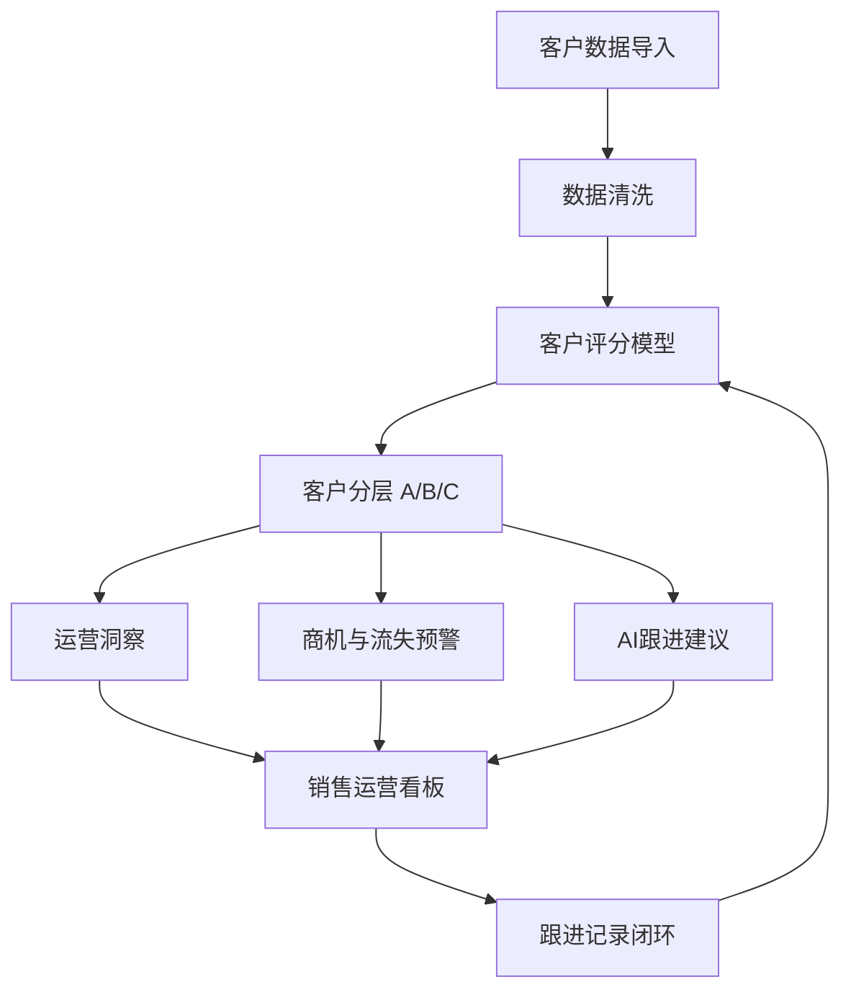
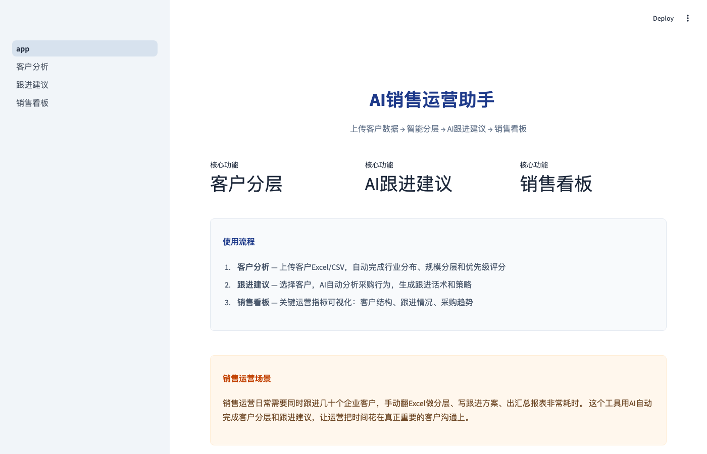
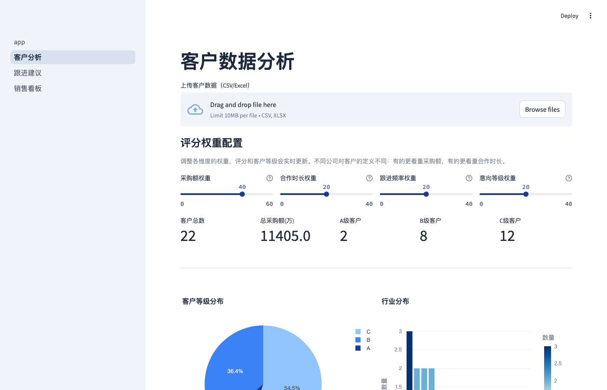
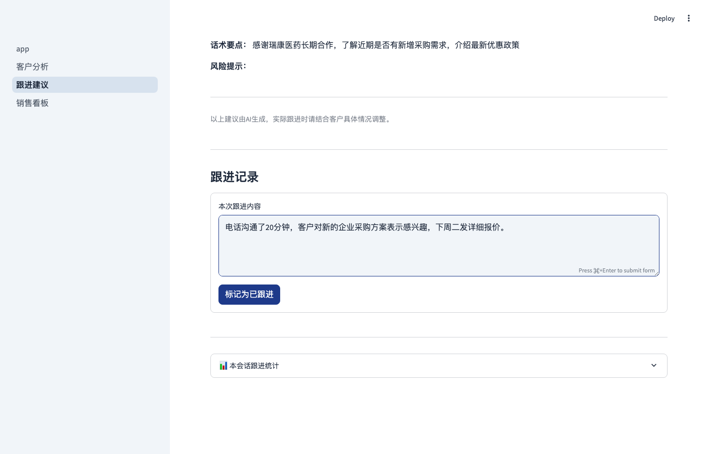
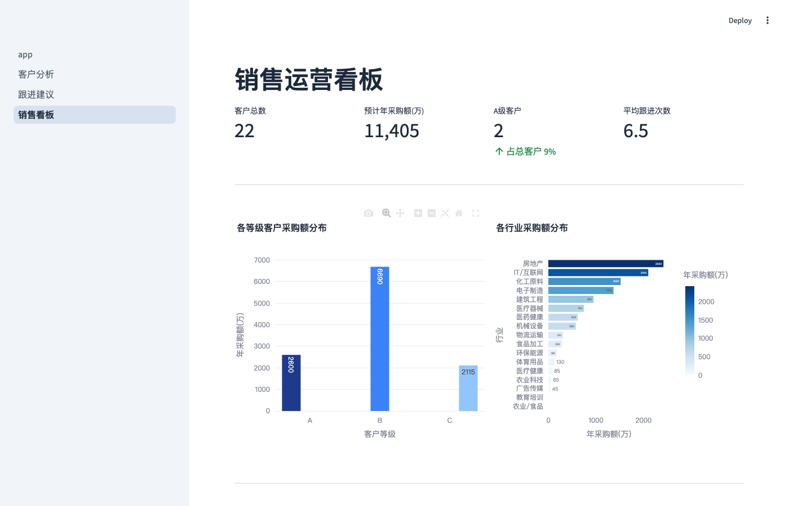

# AI销售运营助手

> 客户分层 · AI跟进建议 · 商机预警 · 销售运营看板

**一个面向B2B销售场景的客户分析与跟进辅助工具：上传客户数据 → 分层评分 → AI跟进建议 → 看板监控。覆盖从客户分析到跟进决策的主要环节。**

[](https://ai-sales-ops-assistant-nhihgfr9twrytdrmdatbbr.streamlit.app)
[](https://github.com/Jofish07/ai-sales-ops-assistant)

---

## 项目背景

在很多销售团队中，客户信息、跟进记录、沟通习惯往往分散在不同人员手中。当客户交接、新人接手或团队扩张时，销售人员需要花费较长时间重新了解客户背景与合作情况。

因此我尝试利用数据分析与AI工具，将部分客户分析逻辑与跟进经验进行结构化整理，为销售运营工作提供辅助决策参考。项目目标不是替代销售，而是帮助团队更系统地整理客户信息、识别潜在商机与风险，支持客户管理与跟进决策。

---

## 核心功能

| 功能 | 说明 |
|------|------|
| **客户分层评分** | 基于四维评分体系（采购贡献/合作周期/跟进活跃度/意向等级），自动输出ABC分类，辅助资源优先级分配 |
| **权重动态配置** | 用户可根据业务重心实时调整各维度权重，适应不同销售策略 |
| **AI跟进建议** | 集成OpenAI API，自动生成客户状态分析、跟进时机与策略话术；无API时由规则引擎降级兜底 |
| **销售运营看板** | Plotly可视化客户结构、行业分布、采购趋势与跟进情况，支持交互式探索 |
| **脏数据检测** | 自动识别缺失值、异常客户模式，处理真实业务中常见的脏数据场景 |
| **商机与流失预警** | 规则引擎自动发现高意向未跟进、高价值低意向、跟进频率下降等业务异常 |
| **跟进记录闭环** | 支持记录每次客户沟通内容，形成"分析→建议→跟进→记录"的完整循环 |

---

## 系统架构



---

## 项目亮点

### 销售知识沉淀视角

项目关注的不只是客户分析，

更关注如何将部分客户分析逻辑与跟进经验进行结构化整理，

形成可复用的销售运营分析流程。

### AI辅助而非替代

双轨设计：OpenAI API负责生成客户分析和话术建议（需要时）；规则引擎负责评分、预警和兜底（无API时全功能运行）。AI提供参考判断，最终决策权在销售手中。

### 分析到行动闭环

从客户数据中识别潜在问题（哪些客户出现流失信号、哪些客户可能有新需求），并输出具体的跟进建议。不止于展示数据，更关注如何将分析结果转化为行动参考。

### B2B销售场景适配

评分模型在经典RFM框架基础上，针对B2B销售场景做了调整——加入"跟进活跃度"等维度，适应关系型销售的业务特点。权重可配置，不同行业和策略都能适用。

---

## 技术栈

| 层 | 技术 | 用途 |
|----|------|------|
| 框架 | Streamlit | 应用容器，前后端一体 |
| 语言 | Python | 全部逻辑实现 |
| 数据处理 | Pandas | 数据读取、清洗、分组聚合 |
| 可视化 | Plotly | 交互式图表 |
| AI | OpenAI API | 跟进建议生成（可选，规则引擎兜底） |
| 规则引擎 | Python逻辑 | 评分模型、商机预警、运营洞察 |
| 部署 | Streamlit Cloud | 一键部署，自动同步GitHub |

---

## 使用流程

```
1. 上传客户数据 → 支持CSV/Excel，内置22条模拟数据可直接体验
2. 调整评分权重 → 根据业务策略调节各维度权重
3. 查看客户分层 → ABC三级展示，含评分明细和数据异常提示
4. 浏览运营洞察 → 系统自动输出结构分析、商机预警、流失风险
5. 获取跟进建议 → 选择客户，AI生成跟进策略与话术
6. 记录跟进内容 → 每次沟通后记录纪要，追踪客户状态变化
7. 监控销售看板 → 客户结构、行业分布、采购趋势全局可视化
```

---

## AI时代的销售知识沉淀

我认为销售工作的核心仍然是人与人的信任建立。

客户关系维护、
需求理解、
合作达成，

最终都离不开人与人的沟通。

但AI能够帮助团队承担另一部分工作：

- 信息整理
- 客户分析
- 经验沉淀
- 流程标准化

很多销售经验往往沉淀在个人身上。

而AI与数据工具能够帮助企业逐步将部分业务经验转化为组织资产。

因此项目的定位并不是：

"AI替代销售"

而是：

"AI辅助销售运营决策"

帮助团队更系统地管理客户信息与业务知识。

---

## 快速开始

```bash
pip install -r requirements.txt
streamlit run app.py
```

内置22条模拟客户数据，覆盖10+行业，无需额外准备。

---

## 项目截图

| 首页 | 客户分析 |
|:---:|:--------:|
|  |  |

| 跟进建议 | 销售看板 |
|:-------:|:--------:|
|  |  |

---

## 目录结构

```
ai-sales-ops-assistant/
├── app.py                    # 应用入口
├── pages/
│   ├── 01_客户分析.py         # 客户分层+权重配置+运营洞察
│   ├── 02_跟进建议.py         # AI跟进建议+跟进记录
│   └── 03_销售看板.py         # 销售运营看板
├── utils/
│   ├── data_processor.py     # 数据处理/评分模型/洞察引擎
│   └── ai_helper.py          # AI建议/规则引擎降级
├── data/demo_clients.csv     # 22条演示数据
├── screenshots/              # 项目截图
└── requirements.txt
```
